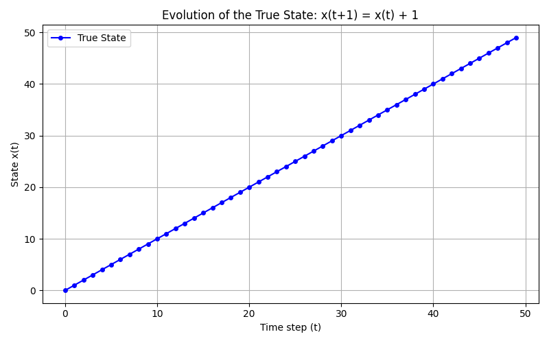
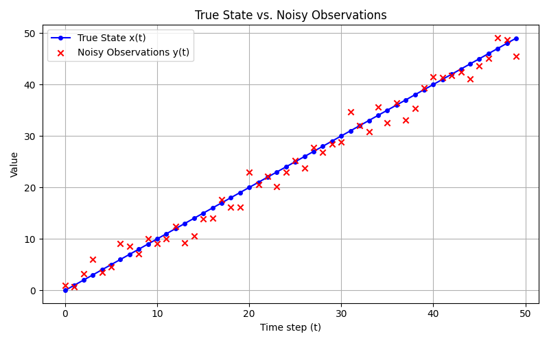
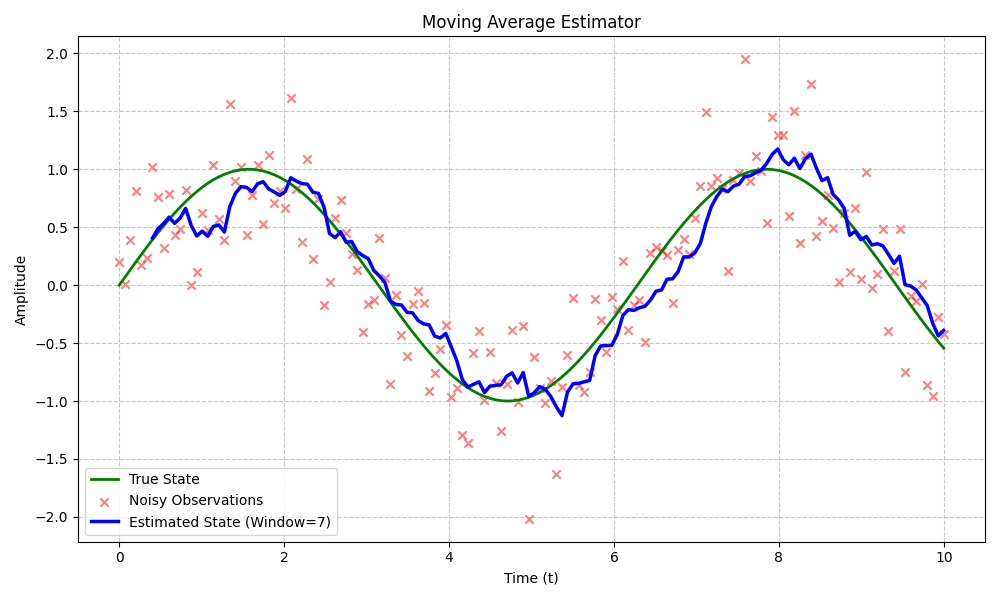

# Estimation and Control: Moving Average Estimator

This document explores the fundamental concepts behind the Moving Average (MA) estimator, comparing true underlying states with noisy sensor observations.

## Visualizing the Process

* **ex1: The Underlying Truth**

* **ex2: Truth vs. Measurement**

* **ex3: The Filtered Output**

---

## Core Concepts

### 1. What is the difference between true state and observation?
* **True State:** This is the actual, physical reality of the system at any given moment (e.g., the exact temperature of a room, the precise speed of a car). In real-world scenarios, the true state is often "hidden" or impossible to know with absolute, perfect certainty.
* **Observation (or Measurement):** This is the data we collect from our sensors. Because sensors are imperfect and environments have interference, observations are always the true state corrupted by some level of **noise**. 
> **Summary:** The observation is what we *see*; the true state is what is *actually happening*. The goal of estimation is to guess the true state based on the observations.

### 2. How does estimation reduce noise?
Estimation algorithms mathematically combine and process observations to filter out the noise. In the case of a Moving Average estimator, it relies on the principle that random noise usually fluctuates around a mean of zero (sometimes it reads too high, sometimes too low). By averaging multiple consecutive data points, the positive and negative noise spikes cancel each other out, revealing the underlying trend or signal.

### 3. How does changing the noise level affect estimation?
* **Low Noise Level:** The observations closely track the true state. The estimator requires less aggressive filtering (a smaller window) to find the truth, meaning it can react very quickly to real changes in the system.
* **High Noise Level:** The observations are scattered wildly around the true state. The estimator must do more work to smooth the data out, usually requiring a larger sample of data to confidently filter out the extreme spikes. The higher the noise, the harder it is to distinguish the actual signal from the interference.

### 4. How does the window size affect the result?
The window size ($N$) determines how many past observations are averaged together to create the current estimate. Tuning this parameter creates a fundamental trade-off between **smoothness** and **responsiveness**.

| Window Size | Smoothing Effect | Responsiveness (Lag) | Best Used When... |
| :--- | :--- | :--- | :--- |
| **Small** (e.g., $N=3$) | Minimal smoothing; the estimate will still look slightly jagged and noisy. | High responsiveness; the estimate tracks rapid changes in the true state with very little delay. | The signal changes rapidly, or the noise level is naturally low. |
| **Large** (e.g., $N=20$) | High smoothing; the estimate becomes a very smooth line, filtering out almost all noise. | Low responsiveness; introduces significant "lag" or phase delay. The estimate will be slow to react to sudden changes in the true state. | The noise level is very high, and the underlying signal changes slowly. |