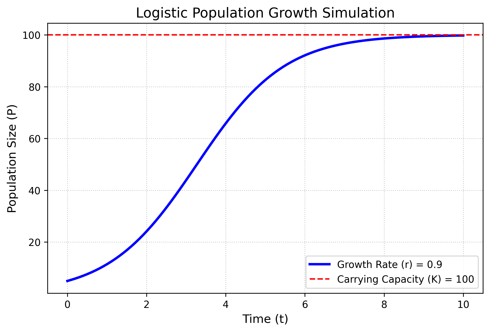
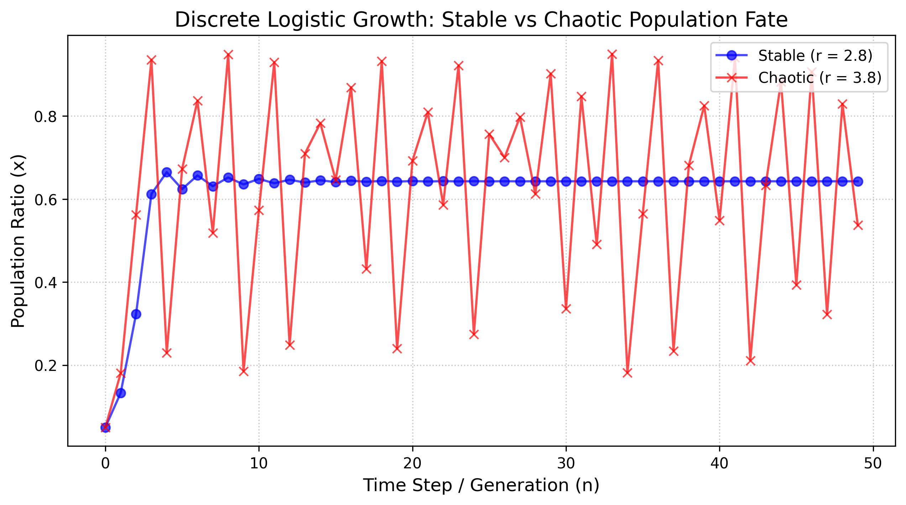
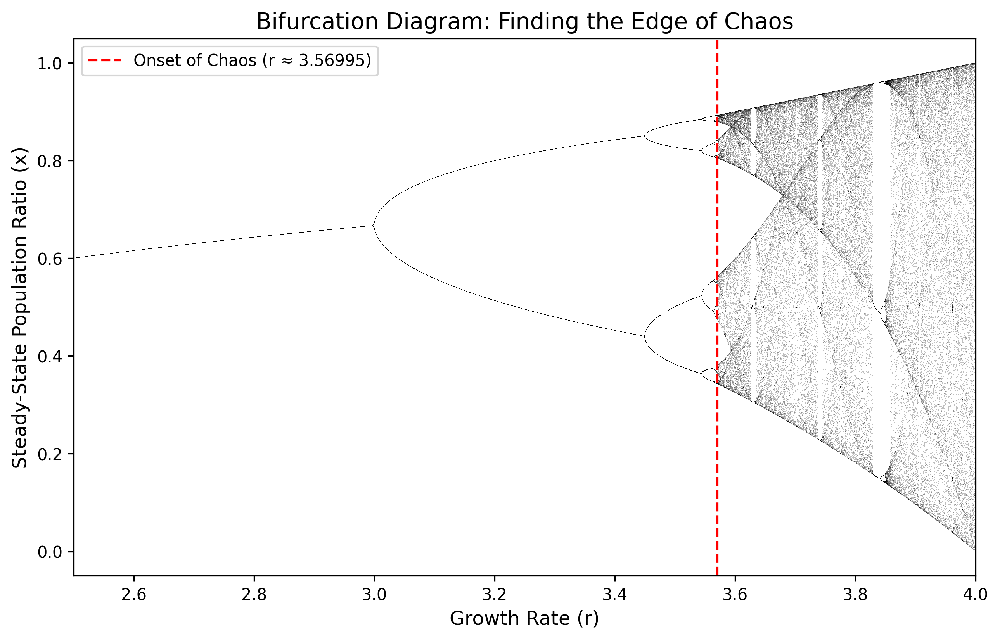
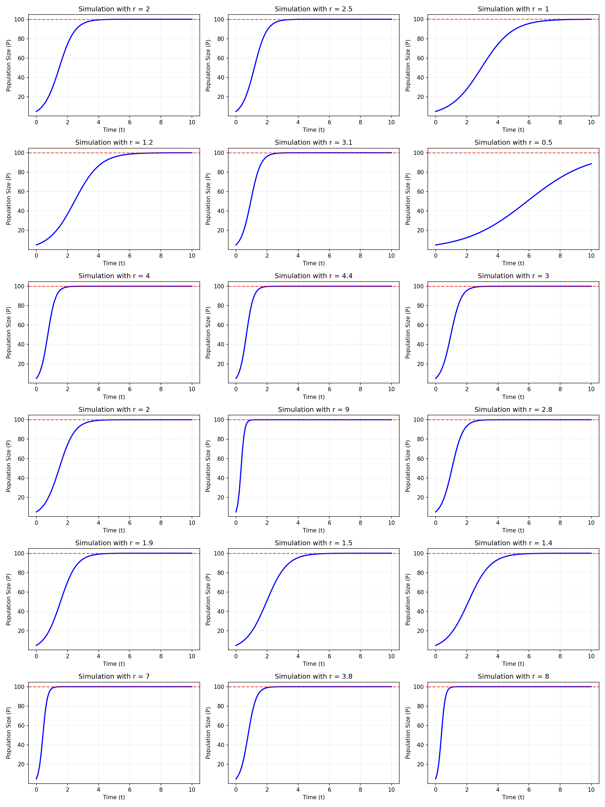
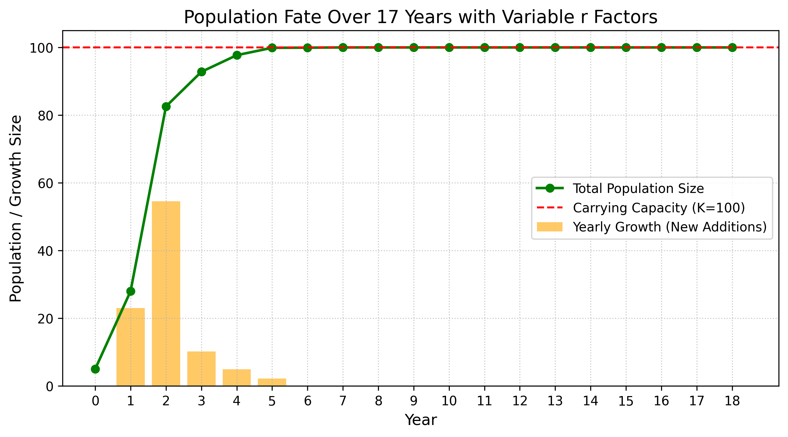
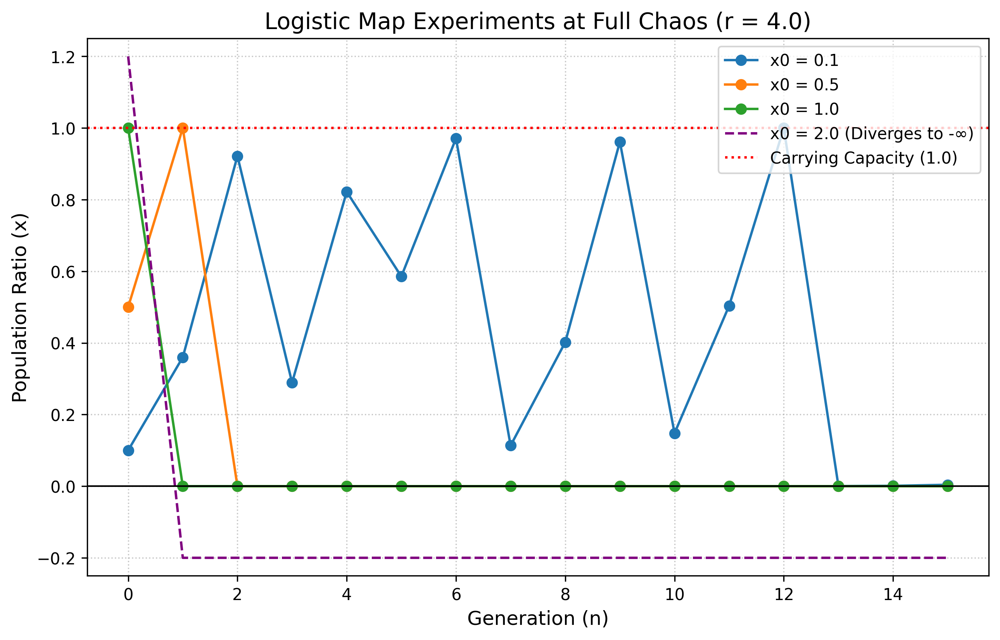

# Estimation and Control: Population Dynamics and Logistic Maps

## Overview
This repository contains a series of simulations exploring population dynamics. It transitions from basic continuous logistic growth to the complex, chaotic behaviors of the discrete logistic map, and concludes with a stochastic Markov Chain population model.

---

## 1. Continuous Logistic Population Growth
This simulation models standard population growth, assuming exponential expansion when resources are abundant, followed by a deceleration as the population approaches its carrying capacity.

**Equation:**
$$P(t)=\frac{K}{1+\left(\frac{K-P_0}{P_0}\right)e^{-rt}}$$

* **Growth Rate (r):** 0.9
* **Fate:** The population follows a classic "S-curve" (sigmoid) trajectory and stabilizes perfectly at the carrying capacity ($K=100$).

---

## 2. The Edge of Chaos (Discrete Map)
Unlike continuous time, populations that breed in distinct generations are modeled using the **discrete logistic map**. This introduces the possibility of instability and chaos.

**Equation:**
$$x_{n+1} = r \cdot x_n \cdot (1 - x_n)$$

* **Stable vs. Chaotic Regime:** At lower growth rates (e.g., $r=2.8$), the population stabilizes. At high rates (e.g., $r=3.8$), the population fluctuates wildly and unpredictably.
* **Onset of Chaos:** The Bifurcation Diagram maps exactly where predictable cycles break down into total chaos (at $r \approx 3.57$).

---

## 3. Independent Simulations Across Multiple Growth Factors
We tested 18 different $r$ values (`[2, 2.5, 1, 1.2, 3.1, 0.5, 4, 4.4, 3, 2, 9, 2.8, 1.9, 1.5, 1.4, 7, 3.8, 8]`) to observe how the continuous logistic curve behaves under varying intensities. 

Higher values cause the population to shoot up to the carrying capacity almost instantly, while lower values show a much slower, gradual S-curve.

---

## 4. Variable Growth Across 17 Years
Treating the 18 $r$ values as a chronological sequence, we simulated a changing environment over 17 years. The previous year's ending population served as the starting point for the new year.

* **Question:** What will be the population growth in the 17th year?
* **Answer:** **0**. 
* **Explanation:** Due to strong early growth factors, the population rapidly expanded and maxed out the environmental carrying capacity early on. By the 17th year, there were no more resources for new additions, permanently capping annual growth at 0.

---

## 5. Extreme Edge Cases at Full Chaos (r = 4.0)
Operating the discrete logistic map at exactly $r = 4.0$ places the system in a state of fully developed chaos. We tested four specific starting population ratios ($x_0$):

* **$x_0 = 0.1$:** The population survives but enters deterministic chaos, fluctuating endlessly between 0 and 1.
* **$x_0 = 0.5$:** The population instantly hits the maximum carrying capacity (1.0) in generation 1, causing total environmental exhaustion and an immediate crash to 0 (extinction) in generation 2.
* **$x_0 = 1.0$:** Starting at maximum capacity leaves no room for growth; the population instantly crashes to 0 in the next generation.
* **$x_0 = 2.0$:** Starting at double the capacity breaks the physical logic of the model. The math rapidly diverges to negative infinity, representing an instant, catastrophic biological collapse.

---

## 6. Markov Chain Population Simulation
This experiment merges stochastic probability with the discrete logistic map. We simulated a 3-state Markov machine with the following transition probabilities:

* **State A:** $\rightarrow$ B (0.4), C (0.6) | **Weight ($r$) = 1.5**
* **State B:** $\rightarrow$ A (0.5), B (0.5) | **Weight ($r$) = 2.0**
* **State C:** $\rightarrow$ A (0.2), B (0.2), C (0.6) | **Weight ($r$) = 3.3**

By running the Markov machine for 15 steps, we generated a random sequence of states. The corresponding weight for each state was used as the $r$ factor to calculate the population generation by generation (starting from $x_0 = 0.5$). Because the $r$ value changes unpredictably based on the Markov transitions, the population size jumps dynamically between stable growth and chaotic oscillation.

*(Refer to the terminal output of `markov_population.py` for the exact randomized sequence of your run).*